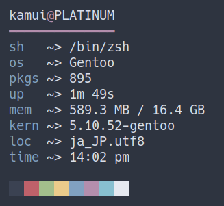

# rfetch
A fast, pretty, and configurable fetch program to output system information.

 

## Setup
Before the installation, ensure that you have `rust`, `cargo`, and `git` installed on your system.
```bash
$ git clone https://github.com/kamui-7/rfetch.git
$ cd rfetch
$ cargo build --release
```
The resulting binary will be located in `./target/release`. You may move that binary file into any directory in your `$PATH` for execution without an absolute path.

Now you need to copy the default config over with:
```bash
$ mkdir -p ~/.config/rfetch
$ cp config.toml ~/.config/rfetch
```

If you want rfetch to be able to show battery info, you will need to enable the 'battery' feature. Replace the compilation command above with
```bash
$ cargo build --release --features=battery  
```
